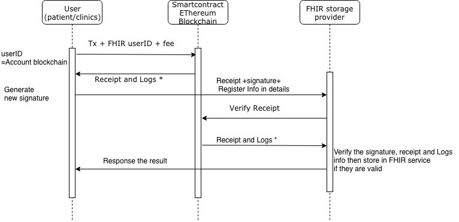
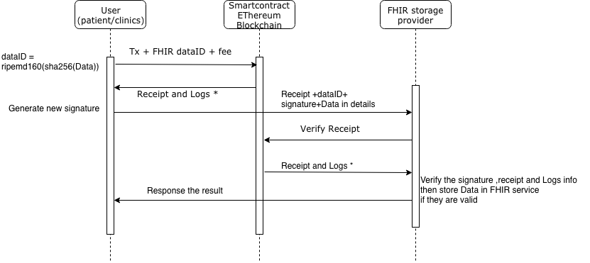

# This is gate keeper for Healthcare Service

* The requisition:
    * Node version 8.12 or later
    * Mongodb version 3.0 or later
    * [Get ethereum node ver 1.8.2](https://gethstore.blob.core.windows.net/builds/geth-linux-amd64-1.8.2-b8b9f7f4.tar.gz)
    * [FHIR  storage service](https://github.com/reapra-hbaocr/node-fhir-server-mongo)
    * [Metamask  add-on as a personal wallet](https://metamask.io)

## This code work as FHIR service provider  to manage the workflows  below

---

 ## Workflow of register new users

 

---

## Workflow of insert new FHIR information

 

---

## Workflow of read FHIR information

 

## Live Demo

* Metamask setup 
    * [Metamask  add-on as a personal wallet](https://metamask.io)
    * Point to new custom RPC http://3.0.166.183:8545 and network ID 122018
    * Create new Account
    * Ask faucet service to get free ETH to your current account on metamask to used in this system http://3.0.228.208:9000/faucet.html

* Run application (make sure you have metamask on your Chrome/Firefox/Brave (Safari  doesn't currently support ))
    * Visit this  link http://3.0.228.208:9000
    * Visit this  link http://3.0.228.208:8000 to  lookup the Txs
    * Visit this  link http://3.0.228.208:9000/faucet.html to ask for token